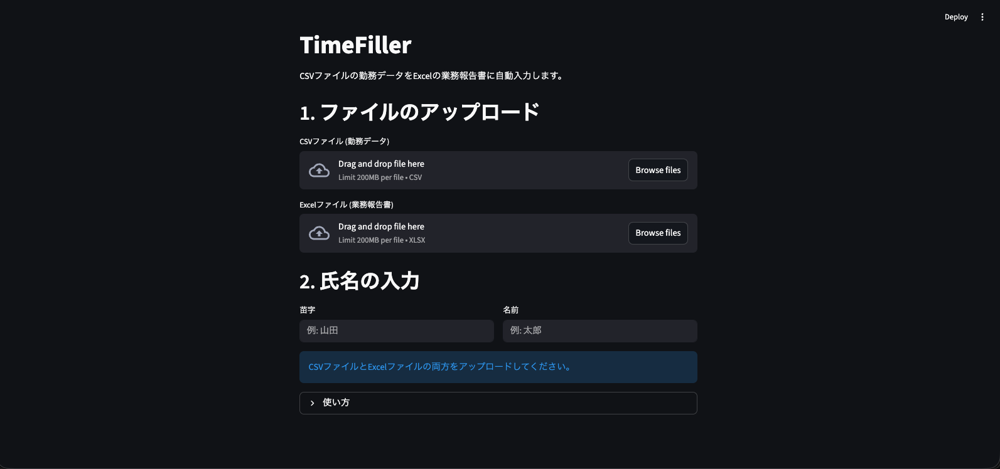

# TimeFiller (勤務データ自動入力ツール)

CSVファイルの勤務データをExcelファイルに自動入力するツールです。
AWS EC2へのデプロイに対応し、ブラウザから簡単に利用できます。

## 機能

- **自動入力**: CSVファイルからExcelの業務報告書へデータを自動転記
- **自動計算**: 出勤日数、総稼働時間を自動計算
- **ファイル名自動生成**: 氏名に基づいたファイル名でダウンロード可能
- **CSVプレビュー**: アップロードしたCSVファイルの内容を確認可能
- **リアルタイム検証**: 氏名入力時に即座にフィードバック
- **直感的なUI**: アイコンと視覚的な階層で使いやすいインターフェース
- **バックアップ**: 処理実行時にバックアップを自動作成（ローカル実行時）



## ファイル構成

```
kintai/
├── app.py                        # Streamlit Webアプリ
├── attendance_auto_input.py      # コアロジック
├── config.py                     # 設定ファイル
├── DEPLOY_EC2.md                 # AWS EC2デプロイ手順書
├── Dockerfile                    # コンテナ化用設定
├── docker-compose.yml            # Docker Compose設定
├── nginx/                        # Nginx設定（HTTPS化用）
├── init-letsencrypt.sh          # SSL証明書取得スクリプト
├── requirements.txt              # 依存ライブラリ
└── README.md                     # このファイル
```

## 使用方法 (Webアプリ)

### 1. ローカルでの実行

```bash
# 依存ライブラリのインストール
pip install -r requirements.txt

# アプリの起動
streamlit run app.py
```

ブラウザで `http://localhost:8501` にアクセスしてください。

### 2. AWS EC2へのデプロイ

詳細な手順は [DEPLOY_EC2.md](DEPLOY_EC2.md) を参照してください。

## アプリの使い方

1. **CSVファイル**（勤務データ）をアップロードします
   - ジョブカン勤怠管理からCSVをダウンロードできます
   - アップロード後、ファイル情報とプレビューが表示されます

2. **Excelファイル**（業務報告書のテンプレート）をアップロードします

3. **苗字と名前**を入力します
   - リアルタイムで入力検証が行われます
   - 両方入力すると実行ボタンが有効になります

4. **「自動入力を実行」**ボタンを押します

5. 処理が完了すると、**ダウンロードボタン**が表示されます

## 使用方法 (コマンドライン)

従来のコマンドライン実行も可能です。

```bash
python3 attendance_auto_input.py [CSVファイル] [Excelファイル] [-o 出力ファイル]
```

## 必要な環境

- Python 3.12 以上
- 必要なライブラリ (requirements.txt参照):
  - streamlit
  - pandas
  - openpyxl

## カスタマイズ

`config.py`ファイルを編集することで、Excelの列位置や休日区分などをカスタマイズできます。

## 更新履歴

- **v3.0.0** (2025-11-20): UI大幅改善
  - アイコンとビジュアル要素の追加
  - CSVプレビュー機能
  - リアルタイム入力検証
  - ヘルプ情報の配置最適化
  - 視覚的な階層とグルーピング
  - パスワード認証機能の削除（社内利用のためIP制限で対応）
- **v2.0.0**: Webアプリ化 (Streamlit)、AWSデプロイ対応
- **v1.0.0**: 初回リリース (コマンドライン版)
